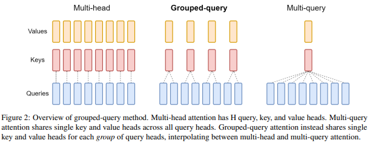
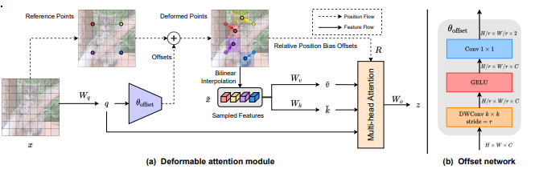
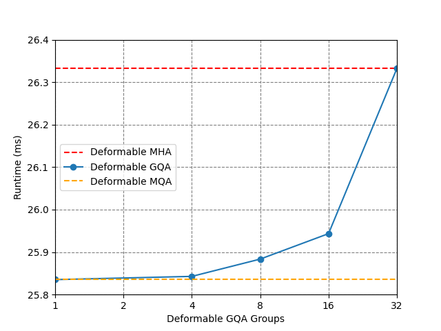
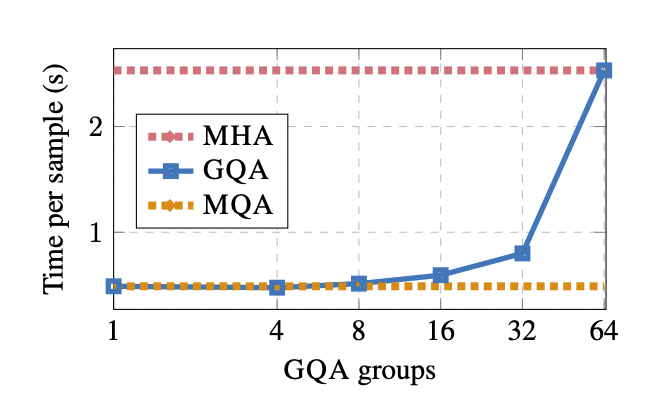

</img> 
</img>

PyTorch implementation combining grouped-query attention (GQA) from (https://arxiv.org/abs/2305.13245) with deformable attention (https://arxiv.org/abs/2201.00520). Adapted from the deformable attention implementation by Lucidrains, https://github.com/lucidrains/deformable-attention with inspiration taken from https://github.com/fkodom/grouped-query-attention-pytorch.

The code in this repository was tested with python 3.10 on Ubuntu 24.04.

## Usage
```python
import torch
from deformable_gqa import DeformableAttention2D

attn = DeformableAttention2D(
    dim=512,               # feature dimensions
    dim_head=64,           # dimension per head
    heads=8,               # attention heads
    num_groups=2,          # number of GQA groups
    dropout=0.0,           # dropout
    downsample_factor=4,   # downsample factor (r in paper)
    offset_scale=4,        # scale of offset, maximum offset
    offset_groups=None,    # number of offset groups, should be multiple of heads
    offset_kernel_size=6,  # offset kernel size
)

x = torch.randn(1, 512, 64, 64)
attn(x)
```
## Benchmark
We benchmark our implementation to determine the effect of GQA on deformable attention runtime. To replicate the benchmark on your machine, run the following command:

```bash
python benchmark.py
```

Note that GQA does not reduce the amount of computation required for deformable attention, it only reduces the amount of memory used. If the execution speed is not memory bandwith limited, you will not see any significant speed-up. The benchmark was run on an RTX 4090.

</img> 

If we compare the graph from our deformable GQA benchmark to the benchmark results from the original GQA paper, which applied the grouped query mechanism to regular scaled dot product attention, we see that they have similar shapes. Quantitatively they are very different; this is to be expected, since we use different hardware, different batch size, sequence length, embedding dimension etc. and a different form of attention.

</img> 

## Citation

```bibtex
@misc{ainslie2023gqatraininggeneralizedmultiquery,
      title={GQA: Training Generalized Multi-Query Transformer Models from Multi-Head Checkpoints}, 
      author={Joshua Ainslie and James Lee-Thorp and Michiel de Jong and Yury Zemlyanskiy and Federico Lebrón and Sumit Sanghai},
      year={2023},
      eprint={2305.13245},
      archivePrefix={arXiv},
      primaryClass={cs.CL},
      url={https://arxiv.org/abs/2305.13245}, 
}
```

```bibtex
@article{xia2023dat,
    title={DAT++: Spatially Dynamic Vision Transformer with Deformable Attention}, 
    author={Zhuofan Xia and Xuran Pan and Shiji Song and Li Erran Li and Gao Huang},
    year={2023},
    journal={arXiv preprint arXiv:2309.01430},
}
```

```bibtex
@InProceedings{Xia_2022_CVPR,
    author    = {Xia, Zhuofan and Pan, Xuran and Song, Shiji and Li, Li Erran and Huang, Gao},
    title     = {Vision Transformer With Deformable Attention},
    booktitle = {Proceedings of the IEEE/CVF Conference on Computer Vision and Pattern Recognition (CVPR)},
    month     = {June},
    year      = {2022},
    pages     = {4794-4803}
}
```
